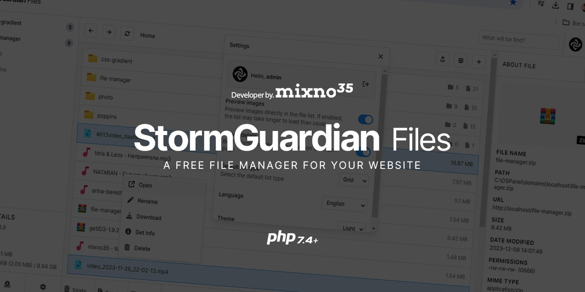

# StormGuardian Files



```All innovations are tested in Firefox, Chrome```

Currently __StormGuardian Files__ is available in more than 6 languages, such as: ```English```, ```German```, ```Spanish```, ```French```, ```Portuguese```, ```Chinese (Simplified)```, ```Japanese```, ```Hindi```, ```Russian```, ```Belarusian```, ```Ukrainian```.

__StormGuardian Files__ - It is a web-based file manager that makes it easier to interact with files on your server or hosting. To work correctly, provide permission _**777**_ для __StormGuardian Files__.

To log in under the Administrator, use: ```Login: admin``` ```Password: admin```. When using __StormGuardian Files__ on your server or hosting, it is recommended to change the password and login - ```/php/class/CheckSession.php``` > ```SESSION_USERS```.

For the correct operation of __StormGuardian Files__ the PHP version is recommended - ```8.1``` and above, it is possible and below, but it is not recommended (some functions may not be available). The minimum version of PHP for correct operation - ```7.4```.


#### READY:
There will be functions that are already ready on the client side(ready - :ballot_box_with_check:, not ready - :blue_square:) and/or on the backend side(ready - :white_check_mark:, not ready - :green_square:).
- :ballot_box_with_check::white_check_mark: Directory Preview
- :ballot_box_with_check::white_check_mark: Viewing files and directories
- :ballot_box_with_check::white_check_mark: Deleting files and directories - <kbd>Ctrl</kbd> <kbd>Delete</kbd>
- :ballot_box_with_check::white_check_mark: Creating a file - <kbd>Ctrl</kbd> <kbd>Alt</kbd> <kbd>F</kbd>
- :ballot_box_with_check::white_check_mark: Creating a directory - <kbd>Ctrl</kbd> <kbd>Alt</kbd> <kbd>D</kbd>
- :ballot_box_with_check: Multi selection
- :ballot_box_with_check::white_check_mark: Viewing information about a file and directory
- :ballot_box_with_check::white_check_mark: Search
- :ballot_box_with_check::white_check_mark: Settings
- :ballot_box_with_check::white_check_mark: Media player (for playing audio and video files)
- :ballot_box_with_check::white_check_mark: Font Preview
- :ballot_box_with_check: Mobile version
- :ballot_box_with_check::white_check_mark: Uploading files


#### IN DEVELOPMENT:
There will be functions that are in development here (It is being developed - :green_circle:, postponed - :white_circle:).
- :green_circle: Changing permissions
- :white_circle: Transferring files
- :white_circle: Saving changes to files
- :white_circle: MySQL management (analogous to phpMyAdmin)
- :white_circle: User Editor __StormGuardian Files__

[Suggest an idea](https://t.me/mixno35)

### Changes for 15.12.2023:
- Added a mobile version for search.
- The file and folder allocation system has been changed.

### Changes for 09.12.2023 - 10.12.2023:
- Now you can upload files.
- Improved security.
- The Ukrainian language has been added.
- Improved the page for viewing images.
- The ```get_files``` function has received a new parameter - ```$mimetype```, which allows you to receive files of only one type.

### Changes for 08.12.2023:
- Fixed known bugs.
- New languages have been added, such as: German, Spanish, French, Portuguese, Chinese (Simplified), Japanese, Hindi.
